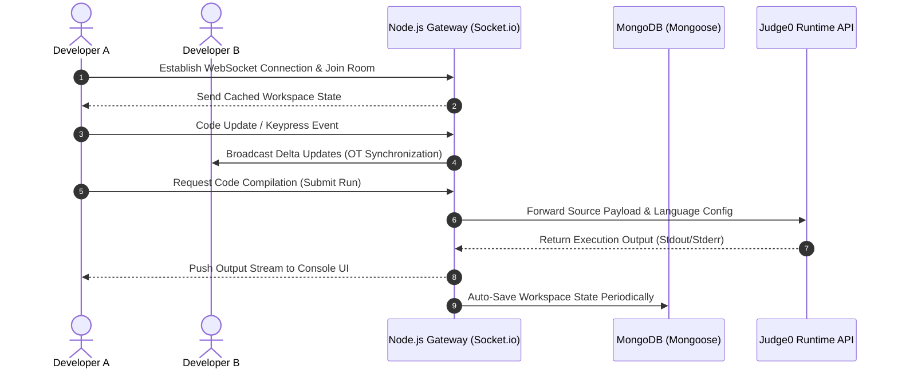

# QuickCode — Real-Time Collaborative IDE & Code Execution Platform

QuickCode is a production-ready, real-time collaborative development environment (IDE) built for modern development teams. It enables developers to create collaborative coding spaces, write code inside an advanced interactive editor, compile and run programs instantly, and manage cloud workspaces.

---

## Key Features
 
* **Real-Time Multi-User Collaboration**
  * Instant, conflict-free text synchronization powered by **Socket.io**.
  * Dynamic visual user presence with active cursor indicators and client avatars.

* **Professional Editor Environment**
  * Integrated **CodeMirror 5** interface with syntax styling, auto-close brackets, and line wrapping.
  * Theme optimization customized for readability and low eye-strain.

* **Remote Code Execution Engine**
  * Multi-language compiler runtime integration using the **Judge0 API**.
  * Real-time execution output feedback directly inside the UI.

* **Cloud Persistence & Security**
  * Secure identity management (Authentication & Authorization) using **Firebase Auth**.
  * Persistent storage for workspaces, rooms, and historical code templates via **MongoDB**.

* **State-of-the-Art User Interface**
  * Premium, responsive glassmorphic UI using standard CSS variables and fluid layout designs.
  * Interactive UI states and transitions powered by **Framer Motion**.

---

## Architecture Flow



---

## Technical Specifications

| Technology Stack | Component | Description |
| :--- | :--- | :--- |
| **React** | Frontend UI Framework | Powers the interactive single-page app structure. |
| **Node.js / Express** | Application Server | Coordinates sockets, handles user APIs, and proxies execution. |
| **Socket.io** | WebSocket Engine | Manages persistent connections and real-time state broadcast. |
| **MongoDB / Mongoose** | Database | Stores workspaces, user profiles, and session metadata. |
| **CodeMirror** | Editor Instance | Provides full-featured code editor capabilities directly in-browser. |
| **Firebase SDK** | Auth & Metadata Services | Authenticates users and stores state metadata securely. |

---

## Configuration & Local Setup

### System Prerequisites
- **Node.js** Version `18.x` or higher
- **MongoDB** Community Server or Atlas Cluster Uri
- **Firebase Project** Credentials

### Installation

1. **Clone Repository**
   ```bash
   git clone https://github.com/MuhammadUmarHanif/Quick-Code.git
   cd Quick-Code
   ```

2. **Package Setup**
   Install all application dependencies:
   ```bash
   npm install
   ```

3. **Environment Variables**
   Configure your environment by setting up a `.env` file in the root directory:
   ```env
   # Application Settings
   PORT=5000
   NODE_ENV=development

   # Database Settings
   MONGO_URI=mongodb+srv://<username>:<password>@cluster.mongodb.net/quickcode

   # Compiling API Endpoint
   JUDGE0_API_URL=https://api.judge0.com
   ```

---

## Running the Application

### Development Environment

To run the application locally with hot-reloading:

* **Startup Backend Server:**
  ```bash
  npm run server:dev
  ```

* **Startup React Client Dashboard:**
  ```bash
  npm run client
  ```

### Production Environment

To optimize, compile assets, and start the application in production mode:

1. **Build Production Assets:**
   ```bash
   npm run build
   ```

2. **Launch Application Gateway:**
   ```bash
   npm run server:prod
   ```

---

## Developer Scripts Reference

| Command | Action |
| :--- | :--- |
| `npm run client` | Starts development server for the React UI. |
| `npm run server:dev` | Launches the server with Nodemon watcher. |
| `npm run build` | Compiles the production build bundle under `/build`. |
| `npm test` | Invokes the Jest unit-test suite. |

---

## License

This project is licensed under the MIT License. See `LICENSE` for further details.